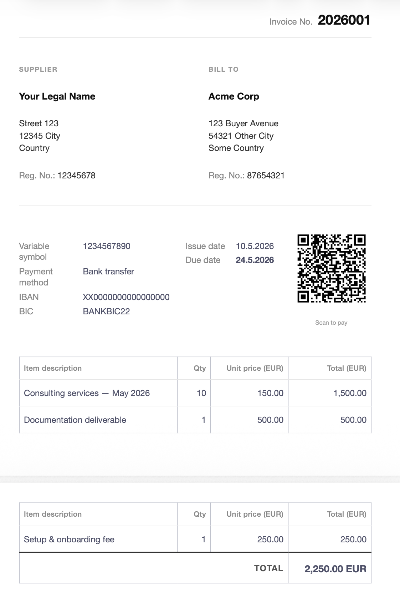

# Obsidian Invoicing System

A complete invoicing workflow inside Obsidian for freelancers and small businesses in the EU/SEPA region. Generate professional EUR invoices with scannable payment QR codes, automatic sequential numbering, and a Dataview dashboard for tracking unpaid, overdue, and yearly revenue — all from a single Templater template.

> Built originally for a Czech freelancer billing in EUR. Adapts cleanly to any SEPA country.

## Features

- **Guided invoice generation** — answer a handful of prompts, get a finished invoice
- **Multi-line items** — add as many services or products as needed; total auto-calculated
- **Automatic sequential numbering** — format `YYYY` + 3-digit sequence (e.g., `2026001`, `2026002`), resets each new year
- **Auto-rename** — note becomes `{invoice_number} {client}.md`
- **Auto-calculated due date** — defaults to 14 days from issue (configurable)
- **Random variable symbol** — 10-digit reference for bank reconciliation
- **EPC payment QR code** — clients scan with Revolut, N26, Wise, or any SEPA bank app to auto-fill IBAN, BIC, amount, and reference
- **Polished print-ready layout** — clean three-column design, exports cleanly to PDF
- **Dataview dashboard** — outstanding, overdue, YTD revenue, by-client breakdown
- **Self-protection** — template refuses to run on itself to prevent accidental data loss

## Preview

A generated invoice has roughly this structure:

## Preview
   
   

## Requirements

- [Obsidian](https://obsidian.md/) (any recent version)
- [Templater](https://github.com/SilentVoid13/Templater) community plugin
- [Dataview](https://github.com/blacksmithgu/obsidian-dataview) community plugin (for the dashboard)
- [QR Code Generator](https://github.com/rudimuc/obsidian-qrcode) community plugin (for payment QR codes)

## Installation

### 1. Install the three community plugins

In Obsidian: **Settings → Community plugins → Browse**, then install and enable:

- `Templater`
- `Dataview`
- `QR Code Generator` by Rudi Häusler

### 2. Set up folders in your vault

Create these folders at the vault root (names can be anything you prefer — just update the CONFIG in step 4):

```
YourVault/
├── Templates/
└── Invoices/
```

### 3. Copy the files into your vault

- Copy [`Templates/invoice-template.md`](./Templates/invoice-template.md) into your `Templates/` folder
- Copy [`examples/Invoices Dashboard.md`](./examples/Invoices%20Dashboard.md) anywhere convenient (e.g., the parent of `Invoices/`)

### 4. Edit the CONFIG block at the top of `invoice-template.md`

Open `Templates/invoice-template.md` and replace the placeholder values at the top:

```javascript
const CONFIG = {
  supplier: {
    legalName: "Your Legal Name",       // shown on invoice (titles + diacritics OK)
    bankName: "Your Bank Name",          // inside QR — MUST match bank registration exactly
    address1: "Street + No.",
    address2: "City + Postal Code",
    country: "Country",
    regNo: "12345678",                   // your business / company registration number
    iban: "XX0000000000000000",
    bic: "BANKBIC22",
  },
  invoicesFolder: "Invoices",            // path inside your vault
  paymentDays: 14,                       // due date offset
};
```

**Important: `legalName` vs `bankName`**

- `legalName` is what is visible on the invoice. Use your full legal name as it appears on tax documents (titles like "Bc.", "Ing.", diacritics, etc.)
- `bankName` is embedded inside the QR code payload. It MUST match exactly how your name is registered with your bank (usually no titles, no diacritics) — otherwise the SEPA transfer may be rejected for a name mismatch.

### 5. Configure the Templater folder template

In **Templater settings → Folder Templates**, click "Add new folder template" and bind:

- **Folder**: `Invoices` (or whatever you named yours)
- **Template**: `Templates/invoice-template`

Now creating any empty note inside `Invoices/` will trigger the template automatically.

### 6. Update the Dashboard path (only if you renamed the folder)

If your invoices folder is not called `Invoices`, open `Invoices Dashboard.md` and find/replace the string `"Invoices"` (with quotes) with your folder path, e.g. `"Work/Invoices"`. The dashboard contains six Dataview queries, each with a `FROM "Invoices"` line that needs updating.

## Usage

### Creating an invoice

1. Right-click the `Invoices/` folder → **New note** (or `Cmd/Ctrl+N` while inside it)
2. The template fires automatically. Prompts appear in order:
   - Invoice number (auto-suggested, just press Enter)
   - Client name, address, country
   - Client Reg. No. (leave empty for individuals)
   - **Line items** (description, quantity, rate) — loops until you leave the description empty
   - Issue date (defaults to today)
3. The note auto-renames itself and pre-fills everything
4. Switch to **Reading view** (`Cmd/Ctrl+E`) to verify the layout
5. **File → Export to PDF** → send to client

### Marking an invoice as paid

In the frontmatter of an invoice file, change:

```yaml
status: unpaid
```

to:

```yaml
status: paid
```

The Dashboard updates automatically.

> **Tip:** If Obsidian shows `status` as a non-editable chip (list type), click the icon next to `status` in the property panel → **Change type** → **Text**. Edit it freely thereafter.

### Viewing the Dashboard

Open `Invoices Dashboard.md` in Reading view to see:

- Outstanding (unpaid total)
- Overdue (past due date, unpaid)
- All unpaid
- Revenue this year
- By client (all time)
- All invoices (master list)

## How it works

### Invoice numbering

When you trigger the template, Templater scans every file in `Invoices/`, reads each one's `invoice_number` frontmatter, and finds the highest sequential number for the **current year**. It then suggests `{year}{seq+1}` (zero-padded to 3 digits) as the default for the new invoice.

You can override the suggestion at the prompt — useful for backdated invoices or filling gaps.

### Payment QR code (EPC standard)

The QR encodes a [SEPA EPC payment payload](https://en.wikipedia.org/wiki/EPC_QR_code) — the European standard recognized by all SEPA-compatible banking apps. When scanned, the client's app pre-fills:

- Beneficiary name (your `bankName`)
- BIC
- IBAN
- Amount in EUR
- Remittance info (`Invoice {num} VS:{vs}`)

The client just confirms and sends. No manual typing of IBAN.

### Visual layout

The invoice is rendered entirely with HTML and inline `style` attributes — no external CSS snippet needed. This means:

- Self-contained: each invoice file carries its own styling
- Reliable: works in any Obsidian theme
- Portable: PDF export reproduces exactly what you see in Reading view

## Customization

### Change the language

Search the template for visible strings (`SUPPLIER`, `BILL TO`, `Invoice No.`, `Variable symbol`, `Issue date`, `Due date`, `Item description`, `Qty`, etc.) and translate them to your language. The QR payload uses standard codes (`BCD`, `SCT`) that do not need translation.

### Adjust the line-item behaviour

The current template requires at least one line item, then loops for additional items until you enter an empty description. To change this:

- **Yes/no prompt after each item instead of empty-description**: replace the `while (true)` loop with `while (await tp.system.prompt("Add another? (y/n)") === "y")`.
- **Fixed maximum**: replace the loop with a `for` loop bounded to your max.
- **Always require N items**: prompt the user upfront for the count, then loop that many times.

### Add VAT / tax handling

For VAT-registered businesses, you would need to:

1. Add a `vatRate` config value (e.g., `21` for 21%)
2. Add a row in the items table for VAT calculation
3. Update the EPC payload amount to include VAT
4. Add a "VAT ID" line in the supplier block

Pull requests welcome.

### Different currency

EPC QR codes only support EUR natively. For non-EUR invoices, either:

- Remove the QR generation entirely
- Use a regional QR standard (Swiss QR-bill, UK Pay.UK, etc.) — requires a different payload format

## File reference

```
.
├── README.md                          # this file
├── LICENSE                            # MIT
├── CONTRIBUTING.md                    # PR guidelines
├── .gitignore                         # ignores Obsidian workspace state
├── Templates/
│   └── invoice-template.md            # the Templater template
└── examples/
    ├── Invoices Dashboard.md          # Dataview dashboard
    └── example-invoice.md             # rendered example with placeholder data
```

## License

MIT — see [LICENSE](./LICENSE). Use it, fork it, sell it, whatever.

## Acknowledgments

- Built on [Templater](https://github.com/SilentVoid13/Templater) by SilentVoid13
- QR codes by [obsidian-qrcode](https://github.com/rudimuc/obsidian-qrcode) by Rudi Häusler
- Dashboard powered by [Dataview](https://github.com/blacksmithgu/obsidian-dataview) by blacksmithgu
- EPC QR specification by the [European Payments Council](https://www.europeanpaymentscouncil.eu/)

## Contributing

PRs welcome. Especially appreciated:

- Localizations (template strings in other languages)
- VAT / tax support
- Other regional payment QR formats (Swiss QR-bill, Czech SPAYD, Polish BLIK, etc.)
- Better expense tracking integration

## Disclaimer

This is provided as-is. Verify generated invoices meet your country's legal requirements before sending. The author is not responsible for incorrect tax filings, rejected SEPA transfers, or any other consequences. Test with a real scan and a small amount before billing high-value clients.
